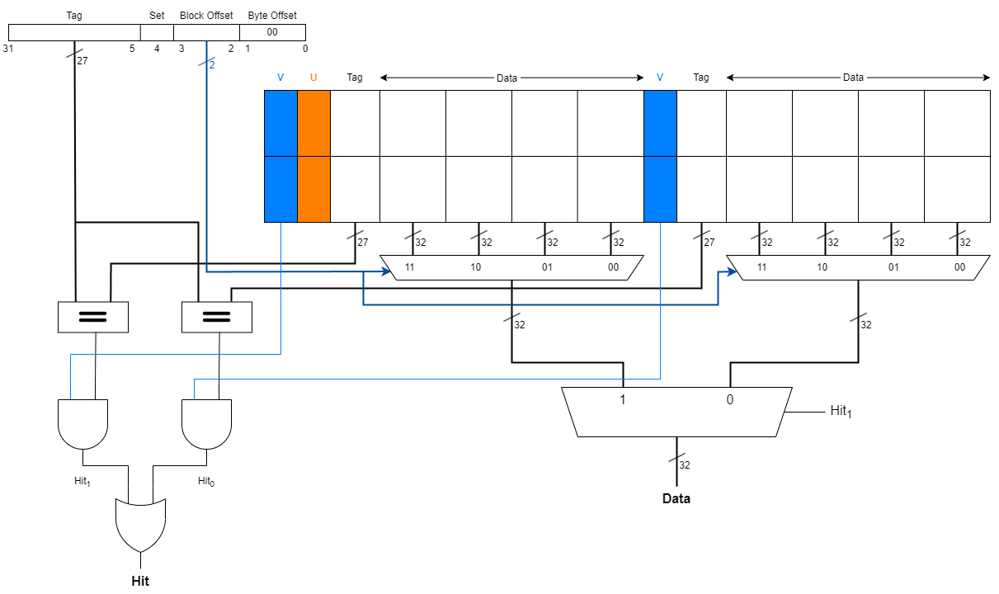

## Guanxi Lu Personal Statement
## Table of Contents
- [My Contributions](#my-contributions)
  - [Summary](#summary)
  - [Control Unit, Instruction Memory, and Extend Unit](#control-unit-instruction-memory-and-extend-unit)
  - [F1 Assembly Language Program](#f1-assembly-language-program)
  - [Top Level Design](#top-level-design)
  - [Debug](#debug)
  - [Cache](#cache)
- [Mistakes I've made](#mistakes-ive-made)
  - [Implementation of `LUI` and `AUIPC` Instructions](#implementation-of-lui-and-auipc-instructions)
  - [Handling "Don't Care" Values (`X`) in the Control Unit](#handling-dont-care-values-x-in-the-control-unit)
  - [Implementing Data Memory Operations for the `SB` Instruction](#implementing-data-memory-operations-for-the-sb-instruction)
  - [Version Control](#version-control)
- [Special Design Decisions](#special-design-decisions)
  - [Introduction of `ALUSrcA` Signal for `SrcA` Input Selection](#introduction-of-alusrca-signal-for-srca-input-selection)
  - [Introduction of `JalSrc` Signal for `PC` logic](#introduction-of-jalsrc-signal-for-pc-logic)
  - [Hardwiring `x0` Register to Zero](#hardwiring-x0-register-to-zero)
- [What I've Learned in This Project](#what-ive-learned-in-this-project)
  - [Tools](#tools)
  - [Soft Skills](#soft-skills)
- [Future Improvements](#future-improvements)

----
## My Contributions
----
### Summary
My contributions primarily focus on the Single Cycle and Cache Versions. In the Single Cycle version, I was tasked with developing the **Control Unit**, **Instruction Memory**, **Extend Unit**, **Top Level Design** and the **F1 Assembly Language Program**. Additionally, [Haocheng](https://github.com/franfafdaf) and I collaborated on debugging the design. For the Cache Version, I selected the cache parameters (2-way associative, 4-word block size, write-through cache) and **designed the corresponding block diagram**. [Haocheng](https://github.com/franfafdaf) took charge of the implementation phase.

Furthermore, I undertook administrative duties within our team. These included managing the **repository structure**, **test and upload design results**, and **authoring the group's joint statement**. As the author of the joint statement (excluding 2-way assosiative Cache section), my design ideas are included in the [joint statement]().

### Control Unit, Instruction Memory, and Extend Unit
- In commit [742b3f2](https://github.com/franfafdaf/IAC_23autumn_Group17-Coursework/commit/742b3f2b9d3cbdc882d3ebd4e2a44154c933a736), a preliminary version including the `Control Unit`, `Instruction Memory`, and `Extend Unit` was developed.
- In commit [7ad151b](https://github.com/franfafdaf/IAC_23autumn_Group17-Coursework/commit/7ad151bcdcd05703ceac779554277482868779ec), the control signals `LdSrc` and `StSrc` were implemented.
- In commit [b205608](https://github.com/franfafdaf/IAC_23autumn_Group17-Coursework/commit/b20560856b1a776b41823b173115e150de2bb01f), a consistency issue within the three units was resolved, providing the final version of individual design. 
- In commit [66ca29e](https://github.com/franfafdaf/IAC_23autumn_Group17-Coursework/commit/66ca29e78ad11d884464effced1b961cd896e20f), the control signal `JSrc` (later `JalSrc`) was added to support `JAL` and `JALR` instructions.
- In commit [3b546db](https://github.com/franfafdaf/IAC_23autumn_Group17-Coursework/commit/3b546dbbe2ff62547c72be2c922010a1a72b18d2), the `ANDI` instruction was implemented.
- In commit [ece7da9](https://github.com/franfafdaf/IAC_23autumn_Group17-Coursework/commit/ece7da9992e138253141a8770041873322f633da), the `XOR` instruction was implemented.

### F1 Assembly Language Program
- In commit [688cef7](https://github.com/franfafdaf/IAC_23autumn_Group17-Coursework/commit/688cef764ed9856d7f1a0f72c6e3f784b42277b2), the LFSR algorithm was tested.
- In commit [1f43366](https://github.com/franfafdaf/IAC_23autumn_Group17-Coursework/commit/1f43366cbbf2e1cbd74327ff4b293625f8f256f4), the F1 program was tested.
- In commit [0252720](https://github.com/franfafdaf/IAC_23autumn_Group17-Coursework/commit/0252720c67880ce14876fee235f90722fae7fdbf), updates were made to `F1.mem` and `instr_mem.sv` for little-endian compatibility.

### Top Level Design
- In commit [8acd52b](https://github.com/franfafdaf/IAC_23autumn_Group17-Coursework/commit/8acd52b568e53151bcaa33f863c420eae30cb694), `top.sv` was created.
- In commit [9b217b3](https://github.com/franfafdaf/IAC_23autumn_Group17-Coursework/commit/9d217b3e988e312c5cde4419e6781a7314f40d2f), wire names were reviewed for consistency.

### Debug
- In commit [b1c012e](https://github.com/franfafdaf/IAC_23autumn_Group17-Coursework/commit/b1c012e75d69ed7a718de6036ab7f22745ecbd9a), `memory_i` and `memory_o` were merged into the main memory.
- In commit [fcc45b1](https://github.com/franfafdaf/IAC_23autumn_Group17-Coursework/commit/fcc45b10d2b2fc1b60bf25297f469b2e6ff83e5d), `DataMemory` was modified for the `SB` instruction.
- In commit [20441ad](https://github.com/franfafdaf/IAC_23autumn_Group17-Coursework/commit/20441ad6e2f968ab042d45c96b7800301764193a), the `trigger` feature was incorporated in the design for the F1 Algorithm.
- In commit [1f43366](https://github.com/franfafdaf/IAC_23autumn_Group17-Coursework/commit/1f43366cbbf2e1cbd74327ff4b293625f8f256f4), the initial value for `PC` was corrected, and `x0` was properly hardwired to 0.

### Cache
- In commit [5a780bf](https://github.com/franfafdaf/IAC_23autumn_Group17-Coursework/commit/5a780bf8b27b6e804563263317ff14605e552321), I defined the parameters and created a preliminary cache design, after which the task was handed over to [Haocheng](https://github.com/franfafdaf). The corresponding block diagram is shown below.

<div align="center">
  
</div>

----
## Mistakes I've made
----

### Implementation of `LUI` and `AUIPC` Instructions
The functionalities of the `LUI` and `AUIPC` instructions are described as follows:
```
LUI rd, imm20:      rd <- imm20 << 12
AUIPC rd, imm20:    rd <- PC + imm20 << 12
```
These instructions involve reading the top 20 bits and either directly writing them to `rd` or adding them to the `PC` before writing to `rd`. 

In the [preliminary design](https://github.com/franfafdaf/IAC_23autumn_Group17-Coursework/commit/c74eb72f294e14942c7f426221aeb79656feeebd), a separate `Up` block controlled by `UpSrc` was added to execute these functions. However, this block proved to be redundant as the `Extend` unit can perform such operations. This realization enhanced my understanding of the `Extend` unit's role: it not only performs sign extension but also handles immediate value manipulations to provide the required `ImmExt` to the ALU.

### Handling "Don't Care" Values (`X`) in the Control Unit

The concept of "Don't Care" values (`X`) in our control unit results from scenarios that isn't expected to occur. For instance, when data does not pass through memory, the `MemWrite` signal is assigned `X`. A challenge we faced was that Verilator struggles to process `X` values.

Three strategies were considered to address this issue:
- Introducing an additional "state" to manage `X` situations.
- Leaving the `X` values as they are.
- Assigning arbitrary values to `X`.

The first option adds unnecessary complexity, potentially requiring more control signal bits. Therefore, I initially chose to leave the `X` values untouched. However, this approach led to warnings and the potential issue of Verilator not compiling parts of the SystemVerilog program.

Consequently, I decided to assign a value of 0 to all `X` values. While this may introduce some ambiguity, we operate under the assumption that the "Don't Care" values will not be utilized by the data path, thus the arbitrary assignment should not impact functionality.

### Implementing Data Memory Operations for the `SB` Instruction

The functionality of the `SB` instruction is outlined as follows:
```
SB rs2, imm12(rs1):     rs2(7:0) -> mem[rs1 + imm12]
```
This instruction modifies data in a single memory location. In our initial design, we overlooked this specific behavior and erroneously modified the entire word as demonstrated in the following code:

```SystemVerilog
if (StSrc) WD_o ={{24{1'b0}}, WD_i[7:0]};//SB
```
The appropriate implementation should only alter the relevant part of the word, leaving the rest unchanged, as corrected in the code below:
```SystemVerilog
else if(WE ==1 && StSrc ==1 ) begin
  data_array[A] <= WD[7:0]; // SB
end
```

### Version Control

As a novice Git user, I struggled with effective version control of the repository. Initially, everything functioned smoothly when each team member worked on their individual branches. However, challenges arose during the merging process. Instead of utilizing the `git merge` command, I manually copied the code to avoid potential conflicts with files like `README.md`. This approach led to misleading representations of work contributions in the commit history.

Additionally, it was only late in the project that I learned about the `.gitignore` file's utility in excluding certain files or folders from being tracked. This oversight resulted in the accidental upload of large `.vcd` files, which exceeded the size limit for direct pushes to the repository.

Furthermore, I realized the importance of composing more meaningful commit messages to better reflect and distinguish the progress made in the project.

----
## Special Design Decisions
----

### Introduction of `ALUSrcA` Signal for `SrcA` Input Selection

In the coursework's example design, there is only one `ALUSrc` signal, which is used to select the input value for `SrcB`. However, for the implementation of the `LUI` and `AUIPC` instructions (functions detailed [above](#implementation-of-lui-and-auipc-instructions)), we introduced an additional multiplexer (MUX) to select the input for `SrcA`. This addition allows for two input options: `PC` and `RD1`. The control logic for this is summarized in the table below:

| Instruction | ALUSrcA | ALUSrcB |
|-------------|---------|---------|
| LUI         | x       | 1       |
| AUIPC       | 1       | 1       |

In the case of `LUI`, the operation solely utilizes `ImmExt`, whereas `AUIPC` involves summing `PC` and `ImmExt` within the ALU.

### Introduction of `JalSrc` Signal for `PC` logic
For `Jump` and `Branch` instructions, the logic determining the output for `PC` differs, as outlined in the table below:

| Instruction | JalSrc | Operation       |
|-------------|--------|-----------------|
| JAL         | 0      | `RD1` + `ImmExt`|
| JALR        | 0      | `RD1` + `ImmExt`|
| BEQ         | 1      | `PC` + `ImmExt` |
| BNE         | 1      | `PC` + `ImmExt` |

I introduced the `JalSrc` signal to select the appropriate signal to be added to `ImmExt`. Although the implementation appears straightforward, it effectively minimizes modifications to the overall design.

### Hardwiring `x0` Register to Zero

In the RV32I ISA, the `x0` register is always hardwired to 0, necessitating a corresponding hardware implementation in the `Register File` block. We explored several methods for this:

- Utilizing `assign` statements to set `x0` to 0: This approach was ineffective. The assignment occurs during the "read" stage, but in the "write" stage, within the same cycle, `x0` could be modified if relevant instructions target it. Consequently, `x0` might not hold zero in that exact cycle.
- Setting `x0` using `always_comb`: This method also faced issues. The value of `x0` could be overwritten within the same block. Moreover, if `x0` received an incorrect value, it would not be corrected in subsequent cycles, as illustrated in the image below:
<div align="center">
  
</div>

Ultimately,  a different logic is implemented, which prevents writing to `x0`. When the destination register `RD` equals 0 (representing `x0`), no register write occurs. As `x0` is initialized to 0, its value remains consistently zero.

----
## What I've Learned in This Project
----

### Tools
- **Git**: Essential for version control and managing repository structure.
- **Markdown**: A lightweight and user-friendly language that can be augmented with HTML for advanced functionality.
- **SystemVerilog**: A Hardware Description Language (HDL) offering both behavioral and structural representations.
- **Verilator**: Useful for compiling SystemVerilog programs into C++ projects.
- **GTKWave**: An effective tool for displaying waveforms.

### Soft Skills
- **Debugging with Waveforms**: While Vbuddy provides a direct view of outcomes, waveforms are more beneficial for debugging. By examining waveforms clock by clock, we can identify any unexpected behavior in signals and refine our design accordingly.
- **Maintaining a Logbook**: Keeping a detailed logbook, both personally and for the group, is vital. It facilitates communication, assists in decision-making, and serves as a reference when composing reports or statements.
- **Developing Test Programs to verify specific functions**: Creating specific test programs to validate various aspects of the design proved invaluable. Examples include tests for [load and store](https://github.com/franfafdaf/IAC_23autumn_Group17-Coursework/blob/top/testprogram1.s), [shift operations](https://github.com/franfafdaf/IAC_23autumn_Group17-Coursework/blob/top/testprogram2-Shift.s), and the [LFSR Algorithm](https://github.com/franfafdaf/IAC_23autumn_Group17-Coursework/blob/top/testprogram3-LFSR.s). These tests targeted at specific functions or algorithms, and were crucial for debugging and verifying specific functionalities.

----
## Future Improvements
----

In future projects, I plan to enhance my approach to repository structure management. Additionally, I aim to dive deeper into various methodologies for implementing F1 logic from a software perspective. I'm also eager to explore more complex structural designs and experience the intricacies of advanced control logic.

