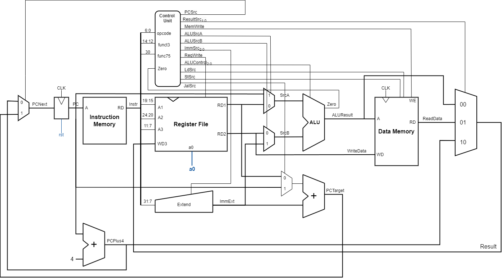

Table of contents 
- [Section 1](#coursework-brief)
- [Section 2](#personal-information)
- [Section 3](#contributions)
- [Section 4](#repo-structure)


# Coursework Brief

This coursework aims to build a reduced RISC-V RV32I Processor. The processor is expected to execute two programs, as specified in the project brief.

Two additional stretch goals are specified for advanced implementation:
1. Pipelined RV32I design.
2. Data Memory Cache.

Through joint efforts, Group 17 has successfully implemented the F1 algorithm in assembly language, verified the program and RV32I design, implemented a pipelined RV32I
 

# Personal Information

# Contributions

Note: 
`X` = Full Participation
`P` = Partial Participation
`U` = Unused Version

# Repo Structure

The group decided to control the version in the following way:
- Each member completes their own section in their own branch.
- One member merges the individual work together, creating `top.sv` for testing.
- Members test and debug the `Single Cycle` version on the `top` branch.
- Once the `Single Cycle` versions are completed, they are separately stored in a new branch.
- Members continue developing the `Pipelined` and `Cache` versions on the `top` branch.
- Once the `Pipelined` and `Cache` versions are completed, they are separately stored in a new branch.
- The final version and `test` folders are completed.

The repo structure can be viewed in the picture below.

This policy leads to both advantages and drawbacks:
- During the individual work stage, all the group members work on separate branches, ensuring their work is not disrupted.
- After all sections are merged, only one final version exists, and all members debug the same version.

- Individual contributions may become unclear, with contributions possibly being attributed incorrectly to different team members due to the commit history, especially when all individual branches are merged. This issue may be mitigated with increased familiarity with Git commands.
- Only one or two members can debug at a time, as simultaneous debugging by more members might cause version conflicts.


> Refer to draw.io file

# Single Cycle Design
## From Lab4 to Project
Lab4 requires group members to complete a reduced RV32I design, to execute a program that consists only two instructions, `ADDI` and `BNE`.

```s
main: 
    addi    t1, zero, 0xff      # load t1 with 255
    addi    a0, zero, 0x0       # a0 is used for output 

mloop: 
    addi    a1, zero, 0x0       # a1 is the counter , init to 0

iloop: 
    addi    a0, a1, 0x0         # load a0 with a1
    addi    a1, a1, 0x1         # increment a1
    bne     a1, t1, iloop       # if a1 == 255, jump to iloop
    bne     t1, zero, mloop     # else always branch to mloop
```

The design, as shown in the diagram below, follows a similar design to Project, despite the fact that ALU block is significantly reduced (only carries out `+` and `-` function), thus leading to a reduced control logic. 


<p align="center">
    <span style="color: grey;">
        Reduced RV32I CPU, Cited from  
        <a href="https://github.com/EIE2-IAC-Labs/Lab4-Reduced-RISC-V">Project Brief</a>
    </span>
</p>

In the project, the increse in instruction to be implemented leads to a more complex control logic. More control signals are intruduced, and the bit number of some signals are increased. 
Further, a generalised logic needs to find to accomodate different types of instructions, even instructions of the same type. For example, the `JALR` and `ADDI` signals are both I-type instructions, however they have apparent difference in terms of function. In this case, it is crucially important to make the design simple (without adding too much exceptions using MUXs or extra blocks), and implement the desired instruction in the mean time. 
What's more, in the project a `Data Memory` block is introduced, to implement instructions like `LW` and `SW`. Following this change, a memory map is set as a reference for design, as shown below. The memory map specifies the memory used by Instruction Memory and Data Memory, and all the designs should strictly follow the memory map. 
<div align="center">
  
</div>

<p align="center">
    <span style="color: grey;">
        Memory Map, Cited From 
        <a href="https://github.com/EIE2-IAC-Labs/Lab4-Reduced-RISC-V?tab=readme-ov-file#the-microarchitecture-of-the-reduced-risc-v-cpu">Project Brief</a>
    </span>
</p>

In Project Brief, we are provided with a design example, as shown in the diagram below, which has introduced several new control signals. 


<p align="center">
    <span style="color: grey;">
        Sample RV32I CPU, Cited from 
        <a href="https://github.com/EIE2-IAC-Labs/Project_Brief?tab=readme-ov-file#single-cycle-rv32i-design">Project Brief</a>
    </span>
</p>

However, in practice, it was found that the structure isn't sufficient to implement all the signals needed. For example, the `JALR` signal required `PC` to become `RS1 + ImmExt`, which cannot be implemented using current design. Also, some specific blocks, like `Control Unit` and `Data Memory` requires a improved design, to either simplify the structure, or accommodate particular instructions, which will be explained in the following parts. 

In this sense, we modified the design (as shown in the diagram below) to provide a suitable design to execute all the instructions in our program. 

<p style = "color: grey;text-align:center;">Single Cycle Design Overview </p> 

## Program Counter
## Instruction Memory
## Extend Unit
## Control Unit
## Data Memory
## ALU
## Assembly Language (F1)
## F1 Design VS Ref Design


# Pipeline Design


# Data Memory Cache Design

# Test Results
## Reference Program
## F1 Program