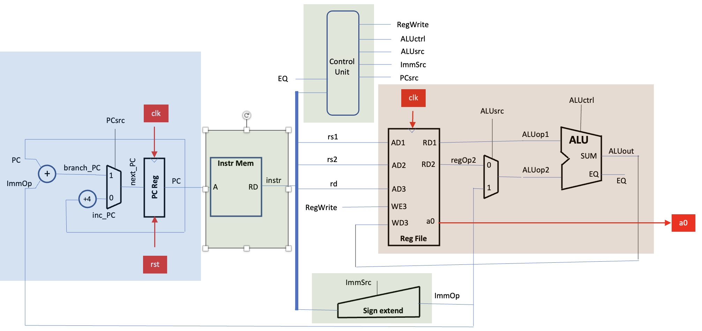
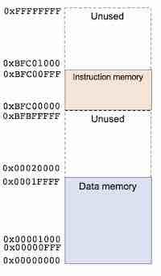
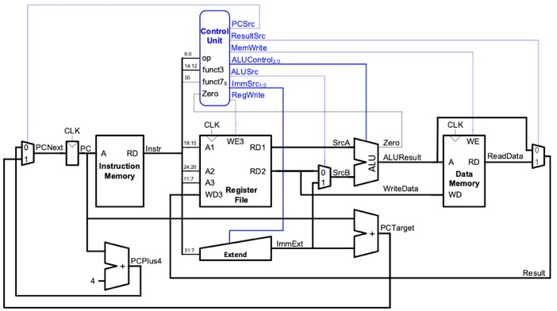

## Table of contents 
- [Project Brief](#project-brief)
- [Personal Information](#personal-information)
- [Individual Contributions](#individual-contributions)
- [Repo Structure](#repo-structure)
- [Single Cycle Design](#single-cycle-design)
    - [Design Overview: From Lab4 to Project](#design-overview-from-lab4-to-project)
    - [Program Counter](#program-counter)
    - [Instruction Memory](#instruction-memory)  
    - [Extend Unit](#extend-unit)
    - [Control Unit](#control-unit)
    - [Data Memory](#data-memory)
    - [ALU](#alu)
    - [Testbench](#testbench)
    - [Shell Script](#shell-script)
    - [Assembly Language (F1)](#assembly-language-f1)
    - [F1 Design VS Ref Design](#f1-design-vs-ref-design)


----
## Project Brief
----

This project aims to build a reduced RISC-V RV32I Processor. The processor is expected to execute two programs, as specified in the project brief.

Two additional stretch goals are specified for advanced implementation:
1. Pipelined RV32I design.
2. Data Memory Cache.

Through joint efforts, Group 17 has successfully implemented the F1 algorithm in assembly language, verified the program and RV32I design, implemented a pipelined RV32I
 
----
## Personal Information
----

----
## Individual Contributions
----

Note: 
`X` = Full Participation
`P` = Partial Participation
`U` = Unused Version

----
## Repo Structure
----
The group decided to control the version in the following way:
- Each member completes their own section in their own branch.
- One member merges the individual work together, creating `top.sv` for testing.
- Members test and debug the `Single Cycle` version on the `top` branch.
- Once the `Single Cycle` versions are completed, they are separately stored in a new branch.
- Members continue developing the `Pipelined` and `Cache` versions on the `top` branch.
- Once the `Pipelined` and `Cache` versions are completed, they are separately stored in a new branch.
- The final version and `test` folders are completed.

The repo structure can be viewed in the picture below.

This policy leads to both advantages and drawbacks:
- During the individual work stage, all the group members work on separate branches, ensuring their work is not disrupted.
- After all sections are merged, only one final version exists, and all members debug the same version.

- Individual contributions may become unclear, with contributions possibly being attributed incorrectly to different team members due to the commit history, especially when all individual branches are merged. This issue may be mitigated with increased familiarity with Git commands.
- Only one or two members can debug at a time, as simultaneous debugging by more members might cause version conflicts.


> Refer to draw.io file
-----
## Single Cycle Design
----
### Design Overview: From Lab4 to Project
Lab4 requires group members to complete a reduced RV32I design, to execute a program that consists only two instructions, `ADDI` and `BNE`.

```s
main: 
    addi    t1, zero, 0xff      # load t1 with 255
    addi    a0, zero, 0x0       # a0 is used for output 

mloop: 
    addi    a1, zero, 0x0       # a1 is the counter , init to 0

iloop: 
    addi    a0, a1, 0x0         # load a0 with a1
    addi    a1, a1, 0x1         # increment a1
    bne     a1, t1, iloop       # if a1 == 255, jump to iloop
    bne     t1, zero, mloop     # else always branch to mloop
```

The design, as illustrated in the diagram below, adheres closely to the Project's framework. However, the ALU block is notably simplified, performing only addition (`+`) and subtraction (`-`) operations. This simplification results in a more streamlined control logic.



<p align="center">
    <span style="color: grey;">
        Reduced RV32I CPU, Cited from  
        <a href="https://github.com/EIE2-IAC-Labs/Lab4-Reduced-RISC-V?tab=readme-ov-file#the-microarchitecture-of-the-reduced-risc-v-cpu">Project Brief</a>
    </span>
</p>

In the project, the increase in the number of instructions to be implemented necessitates a more intricate control logic. This complexity arises from the introduction of additional control signals and the expansion in the bit count of some signals. 

Moreover, a generalized logic must be established to accommodate various types of instructions, including those within the same category. For instance, the `JALR` and `ADDI` instructions are both of I-type, yet they exhibit significant functional differences. Consequently, it is imperative to maintain simplicity in the design (avoiding excessive use of multiplexers or additional blocks) while ensuring the accurate implementation of the desired instructions.

Additionally, the project incorporates a `Data Memory` block to facilitate instructions like `LW` and `SW`. Following this modification, a memory map, as displayed below, is utilized as a reference for the design. This memory map delineates the allocation of memory for the Instruction Memory and Data Memory, and all designs are expected to adhere strictly to this layout.

<div align="center">
  
</div>

<p align="center">
    <span style="color: grey;">
        Memory Map, Cited From 
        <a href="https://github.com/EIE2-IAC-Labs/Lab4-Reduced-RISC-V?tab=readme-ov-file#the-microarchitecture-of-the-reduced-risc-v-cpu">Project Brief</a>
    </span>
</p>

The Project Brief provides a design example, as shown in the diagram below, which introduces several new control signals. 



<p align="center">
    <span style="color: grey;">
        Sample RV32I CPU, Cited from 
        <a href="https://github.com/EIE2-IAC-Labs/Project_Brief?tab=readme-ov-file#single-cycle-rv32i-design">Project Brief</a>
    </span>
</p>

However, it was discovered in practice that this structure is insufficient for implementing all the required signals. For example, the `JALR` instruction necessitates the program counter (`PC`) to become `RS1 + ImmExt`, a functionality not supported by the current design. Furthermore, specific blocks like the `Control Unit` and `Data Memory` require refined designs, either to simplify the structure or to accommodate particular instructions, which will be elucidated in subsequent sections.

In light of these findings, we modified the design (as depicted in the diagram below) to provide an appropriate framework for executing all the instructions in our program. Detailed explanation of specific blocks will be provided in the sections below. 


<p style="color: grey;text-align:center;">Single Cycle Design Overview</p>

Among all the RV32I instructions, 18 are implemented, covering all 6 types of instructions. The **List of Instructions** is shown in the table below.
 
| No | Type   | Instruction | No | Type   | Instruction |
|----|--------|-------------|----|--------|-------------|
| 1  | R-type | ADD         | 12 | S-type | SW          |
| 2  |        | SUB         | 13 |        | SB          |
| 3  |        | AND         | 14 | B-type | BEQ         |
| 4  |        | XOR         | 15 |        | BNE         |
| 5  | I-type | ADDI        | 16 | U-type | LUI         |
| 6  |        | SLLI        | 17 |        | AUIPC       |
| 7  |        | SRLI        | 18 | J-Type | JAL         |
| 8  |        | ANDI        |    |        |             |
| 9  |        | LW          |    |        |             |
| 10 |        | LBU         |    |        |             |
| 11 |        | JALR        |
### Program Counter
The program counter (PC) determines which instruction will be executed in each cycle. In this design, the Instruction Memory starts from `BFC00000` and extends to `BFC00FFF`, indicating that the initial value of PC (set to `0` in Lab4) should be `BFC00000`. 

Typically, the PC increments by 4 due to the nature of byte addressing. In our CPU, each memory block holds 1 byte of data/instruction (equivalent to 8 bits). Given that the instruction and data widths in the RV32I CPU are both 32 bits, occupying 4 memory locations, the PC must increase by 4 to execute the next instruction.

However, there are special cases in our design where the PC is relocated to a different value, as outlined in the table below.

| Instruction | Operation on PC  |
|-------------|------------------|
| BEQ         | PC = PC + Imm12  |
| BNE         | PC = PC + Imm12  |
| JAL         | PC = PC + Imm20  |
| JALR        | PC = RS1 + Imm12 |

Operations on the PC can be classified easily, allowing for straightforward implementation in our design.

- A multiplexer (MUX) determines if a Jump or Branch operation is required.
- For Branch instructions, the operation is always `PC = PC + Imm12`.
- For Jump instructions, the CPU needs to determine whether to add `PC` or `RS1` to `ImmExt`, with the value of `ImmExt` varying based on the instruction type.


<p style="color: grey;text-align:center;">Program Counter</p>


### Instruction Memory
Instruction memory stores the executable instructions. As defined by the memory map, Instruction Memory spans 12 bits (equivalent to 3 hexadecimal digits). Consequently, the address length (`A_length`) is set to 12 bits. Additionally, since the data follows byte-addressing, the data length (`D_length`) is set to 8 bits.

In this design, the Instruction Memory comprises a memory array with a size of \(2^{12} = 4096\) blocks. During each cycle, 4 blocks are concatenated to form the data output (`RD(Instr)`).

It is important to note that RISC-V is a byte-addressing processor employing a little-endian format, where the least significant byte is stored in the lower address. For instance, if the machine code is `F1F2F3F4`, it is stored as follows:

```
Location:   00 01 02 03
Data:       F4 F3 F2 F1 
```
Therefore, the assembly of `RD` from the memory array is executed using the following SystemVerilog assignment:
```SystemVerilog
assign RD = {rom_array[A+3], rom_array[A+2], rom_array[A+1], rom_array[A]};
```

### Extend Unit
The Extend Unit is responsible for fetching parts of the instruction and extending them according to the Instruction Set Architecture (ISA). Among the six types of instructions in RV32I, the I-type, S-type, B-type, U-type, and J-type require extension.


<p style="color: grey;text-align:center;">Cited from RV32I ISA</p>

There are two key points to note. Firstly, all immediates in RV32I are sign-extended. Secondly, the union of bits covered by the immediates is `31:7`; therefore, fetching these instruction bits would be sufficient.

Our group has designed a mapping for the `ImmSrc` with corresponding extension operations, as demonstrated in the table below. Given that five types of instructions require extension, three bits of `ImmSrc` are necessary.

| ImmSrc[2:0] | 000                                 | 001                                              | 010                                                            | 011                                                              | 100                             | 101        | 110        | 111        |
|-------------|-------------------------------------|--------------------------------------------------|----------------------------------------------------------------|------------------------------------------------------------------|---------------------------------|------------|------------|------------|
| Type        | I-type                              | S-type                                           | B-type                                                         | J-type                                                           | U-type                          | Unoccupied | Unoccupied | Unoccupied |
| Extension Operation | `{{20{Instr[31]}}, Instr[31:20]}` | `{{20{Instr[31]}}, Instr[31:25], Instr[11:7]}` | `{{20{Instr[31]}}, Instr[7], Instr[30:25], Instr[11:8], 1'b0}` | `{{12{Instr[31]}}, Instr[19:12], Instr[20], Instr[30:21], 1'b0}` | `{Instr[31:12], {12{0}}}` |

In the `Extend` Unit, mapping the decoded `ImmSrc` to the appropriate extension operations is straightforward.

### Control Unit
### Data Memory
Data Memory facilitates the execution of `Load` and `Store` instructions. For `Load` instructions, data is transferred from memory to registers, whereas for `Store` instructions, it moves from registers to memory.

The diagram below depicts the structure of `Load` and `Store` instructions. `Load` instructions, which are I-type, read data from the memory location `RS1 + Imm[11:0]` and write it to `RD`, with `funct3` differentiating various `Load` types. Conversely, `Store` instructions are S-type, where data from the register `RS2` is written to the memory location `RS1 + Imm[11:0]`, and here too, `funct3` serves to distinguish among different `Store` types.


<p style="color: grey;text-align:center;">Load & Store Structure, Cited from RV32I ISA</p>

As indicated in the memory map, Data Memory spans from 0x00000000 to 0x0001FFFF, necessitating an address length of 17 bits. Adhering to byte-addressing, the data length (`DATA_WIDTH`) is also set to 8 bits. Consequently, Data Memory comprises a memory array of \(2^{17} = 131072\) blocks.

For the standard `LW` (load word) instruction, Data Memory transfers data from memory to register using a little-endian format. The reverse process is applied for the `SW` (store word) instruction. However, the assembly language also necessitates the implementation of `LBU` (load byte unsigned) and `SB` (store byte). `LBU` loads the least significant 8 bits, extended to 32 bits without sign extension, into the register. `SB` alters only the specific memory block addressed by `RS1 + Imm[11:0]` with the least significant 8 bits of `RS2`, rather than the entire word.

To facilitate this, two additional control signals, `LdSrc` and `StSrc`, are introduced (as detailed in the [Control Unit](#control-unit) section). These verify the exact `Load` or `Store` instruction being executed, ensuring the correct corresponding operation.

In summary, the Single Cycle Data Memory is conceptualized as a primary memory with two auxiliary functional blocks. For `Store` instructions, data passes through an additional `Store` block before entering the `Memory` block. Conversely, for `Load` instructions, data traverses an extra `Load` block before being written to registers.


### ALU (Arithmetic Logic Unit)
The ALU is responsible for executing arithmetic and logic operations. In our design, it processes two inputs, `SrcA` and `SrcB`, to produce the output `ALUResult`. 

A MUX is responsible for selecting the appropriate values for SrcA and SrcB respectively. The possible inputs for `SrcA` are `PC` and `RD1`, while for `SrcB`, they are `RD2` or `ImmExt`. The control logic governing these selections is detailed in the [preceding section](#control-unit).

Within the ALU, the operations are determined by the `ALUControl[2:0]` signal, as depicted in the table below. The implementation of these operations follows a straightforward logic.


| ALUControl[2:0] | 000 | 001      | 010 | 011 | 100            | 101 | 110         | 111           |
|-----------------|-----|----------|-----|-----|----------------|-----|-------------|---------------|
| ALU Operation   | Add | Subtract | AND | OR  | Shift to Right | XOR | Select SrcB | Shift to Left |

### Testbench
### Shell Script
### Assembly Language (F1)
### F1 Design VS Ref Design


## Pipeline Design


## Data Memory Cache Design

## Test Results
### Reference Program
### F1 Program