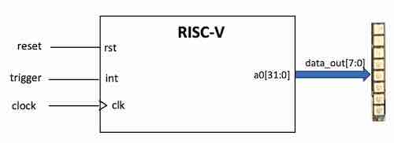

## Table of contents 
- [Project Brief](#project-brief)
- [Personal Information](#personal-information)
- [Individual Contributions](#individual-contributions)
- [Repo Structure](#repo-structure)
- [Single Cycle Design](#single-cycle-design)
    - [Design Overview: From Lab4 to Project](#design-overview-from-lab4-to-project)
    - [Program Counter](#program-counter)
    - [Instruction Memory](#instruction-memory)  
    - [Extend Unit](#extend-unit)
    - [Control Unit](#control-unit)
    - [Data Memory](#data-memory)
    - [ALU](#alu)
    - [Top Level Design](#top-level-design)
    - [Testbench](#testbench)
    - [Shell Script](#shell-script)
    - [Assembly Language (F1)](#assembly-language-f1)
    - [F1 Design VS Ref Design](#f1-design-vs-ref-design)
- [Pipeline Design](#pipeline-design)
- [Data Memory Cache Design](#data-memory-cache-design)
- [Test Results](#test-results)


----
## Project Brief
----

This project aims to build a reduced RISC-V RV32I Processor. The processor is expected to execute two programs, as specified in the project brief.

Two additional stretch goals are specified for advanced implementation:
1. Pipelined RV32I design.
2. Data Memory Cache.

Through joint efforts, Group 17 has successfully implemented the F1 algorithm in assembly language, verified the program and RV32I design, implemented a pipelined RV32I
 
----
## Personal Information
----

----
## Individual Contributions
----

Note: 
`X` = Full Participation
`P` = Partial Participation (modification or debug)
`U` = Unused Version


> **Note:** We would like to acknowledge that due to inadvertent errors in version control, the commit history on the `top` branch may not accurately represent the contributions of the group members. Notably, some files from the `top` branch, which were subsequently merged into the `SingleCycle_F1`, `SingleCycle_Ref`, `Pipelined_F1`, and other branches, were copied instead of being merged from the individual branches (`FHC`, `LGX`, `ZYY`, `CTX`). As a result, in the event of any conflicts, please refer to the table mentioned above for accurate attribution of work.

----
## Repo Structure
----
The group decided to control the version in the following way:
- Each member completes their own section in their own branch.
- One member merges the individual work together, creating `top.sv` for testing.
- Members test and debug the `Single Cycle` version on the `top` branch.
- Once the `Single Cycle` versions are completed, they are separately stored in a new branch.
- Members continue developing the `Pipelined` and `Cache` versions on the `top` branch.
- Once the `Pipelined` and `Cache` versions are completed, they are separately stored in a new branch.
- The final version and `test` folders are completed.

The repo structure can be viewed in the picture below.

This policy leads to both advantages and drawbacks:
- During the individual work stage, all the group members work on separate branches, ensuring their work is not disrupted.
- After all sections are merged, only one final version exists, and all members debug the same version.

- Individual contributions may become unclear, with contributions possibly being attributed incorrectly to different team members due to the commit history, especially when all individual branches are merged. This issue may be mitigated with increased familiarity with Git commands.
- Only one or two members can debug at a time, as simultaneous debugging by more members might cause version conflicts.


> Refer to draw.io file
-----
## Single Cycle Design
----
### Design Overview: From Lab4 to Project
Lab4 requires group members to complete a reduced RV32I design, to execute a program that consists only two instructions, `ADDI` and `BNE`.

```s
main: 
    addi    t1, zero, 0xff      # load t1 with 255
    addi    a0, zero, 0x0       # a0 is used for output 

mloop: 
    addi    a1, zero, 0x0       # a1 is the counter , init to 0

iloop: 
    addi    a0, a1, 0x0         # load a0 with a1
    addi    a1, a1, 0x1         # increment a1
    bne     a1, t1, iloop       # if a1 == 255, jump to iloop
    bne     t1, zero, mloop     # else always branch to mloop
```

The design, as illustrated in the diagram below, adheres closely to the Project's framework. However, the ALU block is notably simplified, performing only addition (`+`) and subtraction (`-`) operations. This simplification results in a more streamlined control logic.


<p align="center">
    <span style="color: grey;">
        Reduced RV32I CPU, Cited from  
        <a href="https://github.com/EIE2-IAC-Labs/Lab4-Reduced-RISC-V?tab=readme-ov-file#the-microarchitecture-of-the-reduced-risc-v-cpu">Project Brief</a>
    </span>
</p>

In the project, the increase in the number of instructions to be implemented necessitates a more intricate control logic. This complexity arises from the introduction of additional control signals and the expansion in the bit count of some signals. 

Moreover, a generalized logic must be established to accommodate various types of instructions, including those within the same category. For instance, the `JALR` and `ADDI` instructions are both of I-type, yet they exhibit significant functional differences. Consequently, it is imperative to maintain simplicity in the design (avoiding excessive use of multiplexers or additional blocks) while ensuring the accurate implementation of the desired instructions.

Additionally, the project incorporates a `Data Memory` block to facilitate instructions like `LW` and `SW`. Following this modification, a memory map, as displayed below, is utilized as a reference for the design. This memory map delineates the allocation of memory for the Instruction Memory and Data Memory, and all designs are expected to adhere strictly to this layout.

<div align="center">
  
</div>

<p align="center">
    <span style="color: grey;">
        Memory Map, Cited From 
        <a href="https://github.com/EIE2-IAC-Labs/Lab4-Reduced-RISC-V?tab=readme-ov-file#the-microarchitecture-of-the-reduced-risc-v-cpu">Project Brief</a>
    </span>
</p>

The Project Brief provides a design example, as shown in the diagram below, which introduces several new control signals. 

<div align="center">
  
</div>

<p align="center">
    <span style="color: grey;">
        Sample RV32I CPU, Cited from 
        <a href="https://github.com/EIE2-IAC-Labs/Project_Brief?tab=readme-ov-file#single-cycle-rv32i-design">Project Brief</a>
    </span>
</p>

However, it was discovered in practice that this structure is insufficient for implementing all the required signals. For example, the `JALR` instruction necessitates the program counter (`PC`) to become `RS1 + ImmExt`, a functionality not supported by the current design. Furthermore, specific blocks like the `Control Unit` and `Data Memory` require refined designs, either to simplify the structure or to accommodate particular instructions, which will be elucidated in subsequent sections.

In light of these findings, we modified the design (as depicted in the diagram below) to provide an appropriate framework for executing all the instructions in our program. Detailed explanation of specific blocks will be provided in the sections below. 


<p align="center">
    <span style="color: grey;">
        Single Cycle Design Overview
    </span>
</p>

Among all the RV32I instructions, 18 are implemented, covering all 6 types of instructions. The **List of Instructions** is shown in the table below.
 
| No | Type   | Instruction | No | Type   | Instruction |
|----|--------|-------------|----|--------|-------------|
| 1  | R-type | ADD         | 12 | S-type | SW          |
| 2  |        | SUB         | 13 |        | SB          |
| 3  |        | AND         | 14 | B-type | BEQ         |
| 4  |        | XOR         | 15 |        | BNE         |
| 5  | I-type | ADDI        | 16 | U-type | LUI         |
| 6  |        | SLLI        | 17 |        | AUIPC       |
| 7  |        | SRLI        | 18 | J-Type | JAL         |
| 8  |        | ANDI        |    |        |             |
| 9  |        | LW          |    |        |             |
| 10 |        | LBU         |    |        |             |
| 11 |        | JALR        |
### Program Counter
The program counter (PC) determines which instruction will be executed in each cycle. In this design, the Instruction Memory starts from `BFC00000` and extends to `BFC00FFF`, indicating that the initial value of PC (set to `0` in Lab4) should be `BFC00000`. 

Typically, the PC increments by 4 due to the nature of byte addressing. In our CPU, each memory block holds 1 byte of data/instruction (equivalent to 8 bits). Given that the instruction and data widths in the RV32I CPU are both 32 bits, occupying 4 memory locations, the PC must increase by 4 to execute the next instruction.

However, there are special cases in our design where the PC is relocated to a different value, as outlined in the table below.

| Instruction | Operation on PC  |
|-------------|------------------|
| BEQ         | PC = PC + Imm12  |
| BNE         | PC = PC + Imm12  |
| JAL         | PC = PC + Imm20  |
| JALR        | PC = RS1 + Imm12 |

What's more, the `rst` signal sets `PC` to the start of the program. Once `rst` is asserted, the value of `PC` becomes `BFC00000`

Operations on the PC can be classified easily, allowing for straightforward implementation in our design.

- A multiplexer (MUX) determines if a Jump or Branch operation is required.
- For Branch instructions, the operation is always `PC = PC + Imm12`.
- For Jump instructions, the CPU needs to determine whether to add `PC` or `RS1` to `ImmExt`, with the value of `ImmExt` varying based on the instruction type.


<p align="center">
    <span style="color: grey;">
        Program Counter
    </span>
</p>


### Instruction Memory
Instruction memory stores the executable instructions. As defined by the memory map, Instruction Memory spans 12 bits (equivalent to 3 hexadecimal digits). Consequently, the address length (`A_length`) is set to 12 bits. Additionally, since the data follows byte-addressing, the data length (`D_length`) is set to 8 bits.

In this design, the Instruction Memory comprises a memory array with a size of \(2^{12} = 4096\) blocks. During each cycle, 4 blocks are concatenated to form the data output (`RD(Instr)`).

It is important to note that RISC-V is a byte-addressing processor employing a little-endian format, where the least significant byte is stored in the lower address. For instance, if the machine code is `F1F2F3F4`, it is stored as follows:

```
Location:   00 01 02 03
Data:       F4 F3 F2 F1 
```
Therefore, the assembly of `RD` from the memory array is executed using the following SystemVerilog assignment:
```SystemVerilog
assign RD = {rom_array[A+3], rom_array[A+2], rom_array[A+1], rom_array[A]};
```

### Extend Unit
The Extend Unit is responsible for fetching parts of the instruction and extending them according to the Instruction Set Architecture (ISA). Among the six types of instructions in RV32I, the I-type, S-type, B-type, U-type, and J-type require extension.


<p style="color: grey;text-align:center;">Cited from RV32I ISA</p>

There are two key points to note. Firstly, all immediates in RV32I are sign-extended. Secondly, the union of bits covered by the immediates is `31:7`; therefore, fetching these instruction bits would be sufficient.

Our group has designed a mapping for the `ImmSrc` with corresponding extension operations, as demonstrated in the table below. Given that five types of instructions require extension, three bits of `ImmSrc` are necessary.

| ImmSrc[2:0] | 000                                 | 001                                              | 010                                                            | 011                                                              | 100                             | 101        | 110        | 111        |
|-------------|-------------------------------------|--------------------------------------------------|----------------------------------------------------------------|------------------------------------------------------------------|---------------------------------|------------|------------|------------|
| Type        | I-type                              | S-type                                           | B-type                                                         | J-type                                                           | U-type                          | Unoccupied | Unoccupied | Unoccupied |
| Extension Operation | `{{20{Instr[31]}}, Instr[31:20]}` | `{{20{Instr[31]}}, Instr[31:25], Instr[11:7]}` | `{{20{Instr[31]}}, Instr[7], Instr[30:25], Instr[11:8], 1'b0}` | `{{12{Instr[31]}}, Instr[19:12], Instr[20], Instr[30:21], 1'b0}` | `{Instr[31:12], {12{0}}}` |

In the `Extend` Unit, mapping the decoded `ImmSrc` to the appropriate extension operations is straightforward.

### Control Unit
The Control Unit is pivotal in determining the control signals based on instructions. It fetches three segments, `Opcode`, `funct3`, and `func75` from `Instr`, and a distinct signal `Zero` from the `ALU`. These four output signals collectively dictate the control signals, influencing the operations of other blocks in the processor. 

#### 1. Control Unit Overview
The table below presents the control signals corresponding to the 18 instructions implemented in the RV32I CPU design. Each instruction type is distinguished by different colors. Among which, blue columns represent input signals, while grey columns (`PCSrc` and `ALUControl[2:0]`) indicate signals requiring two-layer decoding.

<div align="center">
  
</div>
<p align="center">
    <span style="color: grey;"> 
    Control Signal Table
    </span>
</p>

The Control Unit is segmented into three distinct sections:
- The `Main Decoder` utilizes `Opcode[5]` and `funct3` from `Instr`, decoding most signals and providing inputs for other decoders.
- The `PCSrc Decoder` decodes the `PCSrc` signal, leveraging the `Branch` and `Jump` signals from the `Main Decoder`, along with the `Zero` signal from the `ALU`.
- The `ALU Decoder` decodes the `ALUControl[2:0]` signal. It receives `ALUOp[1:0]` from the `Main Decoder`, as well as `Opcode[5]`, `funct3`, and `func75` from `Instr`.

The diagram below illustrates the hierarchical relationship among these three decoder units.

<div align="center">
  
</div>
<p align="center">
    <span style="color: grey;"> 
    Single Cycle Processor Control Unit
    </span>
</p>

"Don't Care" signals are uniquely processed since Verilator does not support them. In practical implementation, all "Don't Care" signals are set to 0. **This does not impact the overall result**, as these signals aren't expected to occur in any valid situations. 

#### 2. ALU Signals
The `ALUSrcA`, `ALUSrcB`, `ALUOp`, and `ALUControl` signals are categorized as ALU signals.

`ALUSrcA` and `ALUSrcB` determine the values for `SrcA` and `SrcB`, the input signals to the `ALU`. The potential inputs for `SrcA` are `PC` and `RD1`, and for `SrcB`, they are `RD2` or `ImmExt`. The decoding logic is as follows:

- R-type instructions use `RD1` and `RD2` respectively for `SrcA` and `SrcB`.
- I-type instructions use `RD1` and `ImmExt`.
- S-type instructions use `RD1` and `ImmExt`.
- B-type instructions, which compare two register values, use `RD1` and `RD2`.
- U-type instructions are more complex:
    - For the `LUI` instruction, which loads the immediate, `SrcA` is unused, and `SrcB` selects `ImmExt`.
    - The `AUIPC` instruction uses both `PC` and `ImmExt`.
- J-type instructions do not utilize `SrcA` or `SrcB`, rendering both `ALUSrcA` and `ALUSrcB` as "Don't Care"s.

`Main Decoder` provides an initial logic to generate `ALUOp`, varying for each instruction type. The association is shown in the following table, where I-type and S-type share the same `ALUOp` due to similar ALU usage in `Load` and `Store` instructions.

| Instruction Type | I&S | B  | R  | U  | J  |
|------------------|-----|----|----|----|----|
| ALUOp[1:0]       | 00  | 01 | 10 | 11 | XX |

The `ALU Decoder` then deciphers the `ALUControl` signal, with each value representing a specific operation. A special case is `110`, designated for "Select SrcB" and aligning with the `LUI` instruction's sole selection of the sign-extended immediate.

| ALUControl[2:0] | 000 | 001 | 010 | 011 | 100 | 101 | 110         | 111           |
|-----------------|-----|-----|-----|-----|-----|-----|-------------|---------------|
| ALU Operation   | Add | Subtract | AND | OR  | Shift Right | XOR | Select SrcB | Shift Left |

#### 3. Register and Memory Signals
`ResultSrc`, `MemWrite`, `RegWrite`, `LdSrc`, and `StSrc` are categorized as Register and Memory Signals.

The RV32I design offers three alternatives for the `Result` signal written to the Register File:
- For ALU-utilizing instructions, `ResultSrc` is `00`, directly passing the ALU result to the register.
- For `Load` instructions that fetch from memory, `ResultSrc` is `01`, writing data from memory to the register.
- For `JAL` and `JALR` instructions, where `RD = PC + 4`, `ResultSrc` is `10`, and `PCPlus4` is written to the register.

`MemWrite` and `RegWrite` signals follow straightforward decode logic:
- `MemWrite` is set only for `Store` instructions; otherwise, it is 0.
- `RegWrite` is 0 for S-type and B-type instructions, which do not write to the register. When relevant, `LdSrc` and `StSrc` act as `SELECT` bits of the MUX. The decoding logic for the two `Load` and `Store` instructions used is simple.

`LdSrc` operates solely for `Load` instructions, while `StSrc` is specific to `Store` instructions. In other scenarios, their values are considered "Don't Care"s:
- `LdSrc` equals 1 for `LBU` instructions, otherwise indicating `LW`.
- `StSrc` equals 1 for `SB` instructions, otherwise indicating `SW`.

#### 4. Jump Signals
`Branch`, `Jump`, `PCSrc`, and `JalSrc` are categorized as Jump Signals.

`Branch` and `Jump` detect whether an instruction is a Jump or Branch type, setting their values to 1 accordingly.

The `PCSrc` signal indicates if the `PC` is to be redirected to a specific value. When `Jump` is 1, so is `PCSrc`. For B-type Instructions, the `Zero` signal is also considered: `PC` is redirected for `BEQ` only if `Zero` is True, and for `BNE`, the opposite applies.

`JalSrc` is specific to `Branch` and `Jump` instructions:
- Its value is 1 for `BEQ`, `BNE`, and `JAL`, indicating `PC` added to `ImmExt`.
- For `JALR`, `JalSrc` is 0, where `RS1` is added to `ImmExt`.

#### 5. Extend Signal
`ImmSrc` is the sole Extend signal, dictating the extension methodology for the immediate part of the instruction. `ImmSrc` varies across different instruction types, and its relationship with each type is detailed in the [Extend Unit Section](#extend-unit). The table below outlines how `ImmSrc` is assigned based on the instruction type:

| ImmSrc[2:0] | 000                                 | 001                                              | 010                                                            | 011                                                              | 100                             | 101        | 110        | 111        |
|-------------|-------------------------------------|--------------------------------------------------|----------------------------------------------------------------|------------------------------------------------------------------|---------------------------------|------------|------------|------------|
| Type        | I-type                              | S-type                                           | B-type                                                         | J-type                                                           | U-type                          | Unoccupied | Unoccupied | Unoccupied |
| Extension Operation | `{{20{Instr[31]}}, Instr[31:20]}` | `{{20{Instr[31]}}, Instr[31:25], Instr[11:7]}` | `{{20{Instr[31]}}, Instr[7], Instr[30:25], Instr[11:8], 1'b0}` | `{{12{Instr[31]}}, Instr[19:12], Instr[20], Instr[30:21], 1'b0}` | `{Instr[31:12], {12{0}}}` |

### Data Memory
Data Memory facilitates the execution of `Load` and `Store` instructions. For `Load` instructions, data is transferred from memory to registers, whereas for `Store` instructions, it moves from registers to memory.

The diagram below depicts the structure of `Load` and `Store` instructions. `Load` instructions, which are I-type, read data from the memory location `RS1 + Imm[11:0]` and write it to `RD`, with `funct3` differentiating various `Load` types. Conversely, `Store` instructions are S-type, where data from the register `RS2` is written to the memory location `RS1 + Imm[11:0]`, and here too, `funct3` serves to distinguish among different `Store` types.


<p align="center">
    <span style="color: grey;">
        Load & Store Structure, Cited from RV32I ISA
    </span>
</p>

As indicated in the memory map, Data Memory spans from 0x00000000 to 0x0001FFFF, necessitating an address length of 17 bits. Adhering to byte-addressing, the data length (`DATA_WIDTH`) is also set to 8 bits. Consequently, Data Memory comprises a memory array of $\(2^{17} = 131072\)$ blocks.

For the standard `LW` (load word) instruction, Data Memory transfers data from memory to register using a little-endian format. The reverse process is applied for the `SW` (store word) instruction. However, the assembly language also necessitates the implementation of `LBU` (load byte unsigned) and `SB` (store byte). `LBU` loads the least significant 8 bits, extended to 32 bits without sign extension, into the register. `SB` alters only the specific memory block addressed by `RS1 + Imm[11:0]` with the least significant 8 bits of `RS2`, rather than the entire word.

To facilitate this, two additional control signals, `LdSrc` and `StSrc`, are introduced (as detailed in the [Control Unit](#control-unit) section). These verify the exact `Load` or `Store` instruction being executed, ensuring the correct corresponding operation.

In summary, the Single Cycle Data Memory is conceptualized as a primary memory with two auxiliary functional blocks. For `Store` instructions, data passes through an additional `Store` block before entering the `Memory` block. Conversely, for `Load` instructions, data traverses an extra `Load` block before being written to registers.


### ALU
The ALU is responsible for executing arithmetic and logic operations. In our design, it processes two inputs, `SrcA` and `SrcB`, to produce the output `ALUResult`. 

A MUX is responsible for selecting the appropriate values for SrcA and SrcB respectively. The possible inputs for `SrcA` are `PC` and `RD1`, while for `SrcB`, they are `RD2` or `ImmExt`. The control logic governing these selections is detailed in the [preceding section](#control-unit).

Within the ALU, the operations are determined by the `ALUControl[2:0]` signal, as depicted in the table below. The implementation of these operations follows a straightforward logic.


| ALUControl[2:0] | 000 | 001      | 010 | 011 | 100            | 101 | 110         | 111           |
|-----------------|-----|----------|-----|-----|----------------|-----|-------------|---------------|
| ALU Operation   | Add | Subtract | AND | OR  | Shift to Right | XOR | Select SrcB | Shift to Left |

### Top Level Design
The top-level design of the system serves as an integrative platform, combining all submodules and establishing the necessary bus connections, thereby exemplifying the concept of hierarchical design. The top-level design encompasses the following modules:

```
pc_top              instr_mem       regfile             alu_top 
control_unit        extend          DataMemory          DataMux
```

Concurrently, assignment statements are utilized to map portions of the bus to specific logic signals. These mappings are highlighted in red in the accompanying diagram.

<div align="center">
  
</div>


### Testbench
In this section we mainly discuss the testbench for Reference Program. The design incorporates three top-level signals: `clk`, `a0`, `rst`. 

In the testbench for the Reference Program, both `clk` and `rst` are initialized to a value of 1. Subsequently, at each clock cycle, `rst` is set to 0, and the value of `a0` is dumped to a VCD file. A boolean variable, `plot`, is used to monitor the status of `a0`. A non-zero value of `a0` denotes the successful completion of the build process, thus `plot` will enable the plotting on Vbuddy. Furthermore, the program is designed to terminate after a specific number of cycles, which varies depending on the version (either 960 or 1920 cycles).

The testbench for the F1 program differs from that of the Reference Program, details of which are elaborated in the [following section](#f1-design-vs-ref-design).


### Shell Script
The shell script employs Verilator to convert Verilog code into C++, which also includes the C++ testbench.

The roles of the shell script are outlined as follows:
- Clearing out data from previous simulations.
- Use Verilator to convert Verilog into C++.
- Build the C++ project.
- Executing the simulation file.

### Assembly Language (F1)
The reference program is designed to build and display the probability distribution function (PDF) for four signals, employing an algorithm structured as **Initialisation - Build - Display**.

- During the **Initialisation** stage, each `a1` value (representing a "bin") is reset, preparing the bins for data accumulation.
- The **Build** stage involves iterating through the data array. Here, counts are added to respective bins based on the data value, e.g., for a data value of `EE`, the count in the `EE` bin is incremented. This stage terminates when the count in any bin reaches `max_count` or upon completion of the iteration.
- The **Display** stage sees the program iterating through the PDF array, loading count numbers into the `a0` register, and generating the corresponding output.

```s
# PDF program
.text
.equ base_pdf, 0x100
.equ base_data, 0x10000
.equ max_count, 200
main:
    JAL     ra, init  # jump to init, ra and save position to ra
    JAL     ra, build
forever:
    JAL     ra, display
    J       forever

init:       # function to initialise PDF buffer memory 
    LI      a1, 0x100           # loop_count a1 = 256
_loop1:                         # repeat
    ADDI    a1, a1, -1          #     decrement a1
    SB      zero, base_pdf(a1)  #     mem[base_pdf+a1) = 0
    BNE     a1, zero, _loop1    # until a1 = 0
    RET

build:      # function to build prob dist func (pdf)
    LI      a1, base_data       # a1 = base address of data array
    LI      a2, 0               # a2 = offset into of data array 
    LI      a3, base_pdf        # a3 = base address of pdf array
    LI      a4, max_count       # a4 = maximum count to terminate
_loop2:                         # repeat
    ADD     a5, a1, a2          #     a5 = data base address + offset
    LBU     t0, 0(a5)           #     t0 = data value
    ADD     a6, t0, a3          #     a6 = index into pdf array
    LBU     t1, 0(a6)           #     t1 = current bin count
    ADDI    t1, t1, 1           #     increment bin count
    SB      t1, 0(a6)           #     update bin count
    ADDI    a2, a2, 1           #     point to next data in array
    BNE     t1, a4, _loop2      # until bin count reaches max
    RET

display:    # function send PDF array value to a0 for display
    LI      a1, 0               # a1 = offset into pdf array
    LI      a2, 255             # a2 = max index of pdf array
_loop3:                         # repeat
    LBU     a0, base_pdf(a1)    #   a0 = mem[base_pdf+a1)
    addi    a1, a1, 1           #   incr 
    BNE     a1, a2, _loop3      # until end of pdf array
    RET
```

In the F1 program, a similar algorithm is adopted, structured as **Initialisation - Generation Light Up - Countdown**. The detailed process is as follows:
- In the `Init` section, thresholds are established, including the fixed countdown value.
- The `rst` section is responsible for resetting the variables.
- During the `mainloop` loop, a 7-bit LFSR (Linear Feedback Shift Register), initialized at 0x7F, is generated.
- In the `light_up` loop, the output register `a0` incrementally increases from `0000_0000` to `0000_0001`, and ultimately to `1111_1111`. Following each increment, the program enters the `lightdelay` loop to perform a fixed-number countdown.
- The `lightdelay` and `final_random` loops conduct countdowns based on a fixed number and a pre-generated random number, respectively.
- Upon completion of the countdown in `final_random`, the program returns to the `rst` section to reinitialize all values.

The algorithm's flow is visually represented in the diagram below, with straight lines illustrating unconditional jumps, and red curves indicating conditional branches.

<div align="center">
  
</div>

### F1 Design VS Ref Design
Upon testing the Single Cycle design on Reference program, the design is modified to accomodate the F1 program as explained above. There are a few points that differs F1 design from Ref Design. 

#### 1. Data Memory
The Reference Program utilizes `load` and `store` instructions such as `LW` and `SB`. However, the F1 design omits these instructions, resulting in no data being written to or read from the Data Memory.

This design choice is linked to the method of pseudo-random number generation in the F1 program. Before the trigger signal is asserted, the program iterates through a loop generating random numbers.

One alternative could involve pre-generating all random numbers and storing them in the data memory. Subsequently, the program could map the `PC` value to a specific location in the data memory to read the random number. However, `PC` would be a constant value at the point where a random number is requested to be loaded. In this case, this approach would transform the random number into a constant, as a fixed one in random number series would exist for a fixed `PC`. 

Another strategy might be to generate a new random number each time `PC` changes, making the random number a by-product of the varying `PC`. However, this could significantly increase the program's complexity, an unnecessary complication.

For the data memory of the reference program, the diagram below illustrates the memory organization. The `data_array` consists of pre-generated values from memory files like `sine.mem`, while the `pdf_array` represents the accumulation in each "bin." Separate memory segments are allocated for `data_array` and `pdf_array`.

<div align="center">
  
</div>
<p align="center">
    <span style="color: grey;"> 
    Cited from 
        <a href="https://github.com/EIE2-IAC-Labs/Project_Brief/tree/main/reference#new-memory-map">Reference Program</a>
    </span>
</p>

#### 2. `Trigger` Signal
A significant difference between the F1 and Reference Programs is the `trigger` signal. As described in the [Project Brief](https://github.com/EIE2-IAC-Labs/Project_Brief/tree/main?tab=readme-ov-file#learning-the-rv32i-instruction-set), "The trigger signal is used to initiate the F1 light sequence in the RISC-V."

<div align="center">
  
</div>
<p align="center">
    <span style="color: grey;"> 
    RV32I F1 Overview, Cited from 
        <a href="https://github.com/EIE2-IAC-Labs/Project_Brief/tree/main?tab=readme-ov-file#learning-the-rv32i-instruction-set">Project Brief</a>
    </span>
</p>

In the `F1.s` assembly program, the `t0` register (`x5`) is used to represent the `Trigger` signal. At the beginning of the `mainloop`, its value is compared with the pre-defined `s1` register to determine if the `trigger` signal has been activated, as depicted in the program extract below.

```s
# F1.s
init:
    addi s1, zero, 0x1      /* trigger destination set as 1 */
...
rst:
...
    addi t0, zero, 0x0      /* t0 is trigger */

mainloop:
    beq  t0, s1, light_up   /* trigger? */
...
``` 

In physical testing, the push-button switch on the Vbuddy functions as the `trigger`. This is configured in the testbench with the line 

```C++
top->trigger = vbdFlag();
``` 

Additionally, Register `t0` in the register file is designated for the trigger signal. Therefore, an extra line is incorporated into `reg_file.sv` to facilitate this:
```SystemVerilog
assign     register[5] = trigger;
```
The modified `reg_file.sv` is illustrated as the diagram below. 
<div align="center">
  
</div>


#### 3. Testbench
As mentioned earlier, the F1 Program employs a distinct testbench from that of the Reference Program. In this testbench, the 32-bit output `a0` is transformed into an 8-bit `data_out` by masking the top 24 bits. Subsequently, the `vbdBar()` function is invoked to display `data_out` on the neopixel.


----
## Pipeline Design
----

----
## Data Memory Cache Design
----

----
## Test Results
----
### Reference Program

- `sine.mem` a sinewave signal
- `triangle.mem` a triangular wave signal
- `gaussian.mem` a noise signal with a gaussian distribution
- `noise.mem` a noisy sinewave signal
### F1 Program